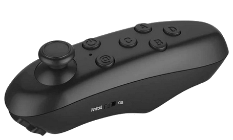
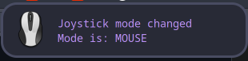
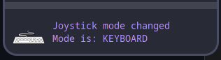
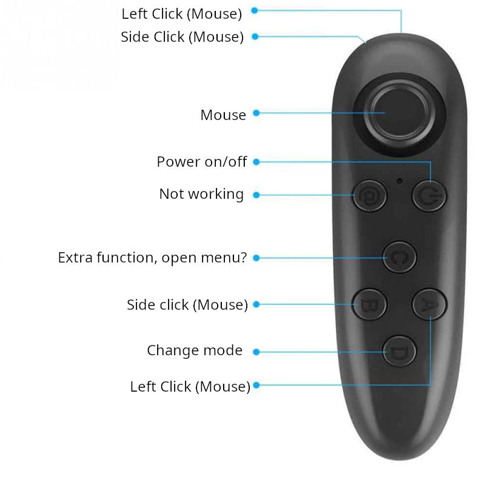
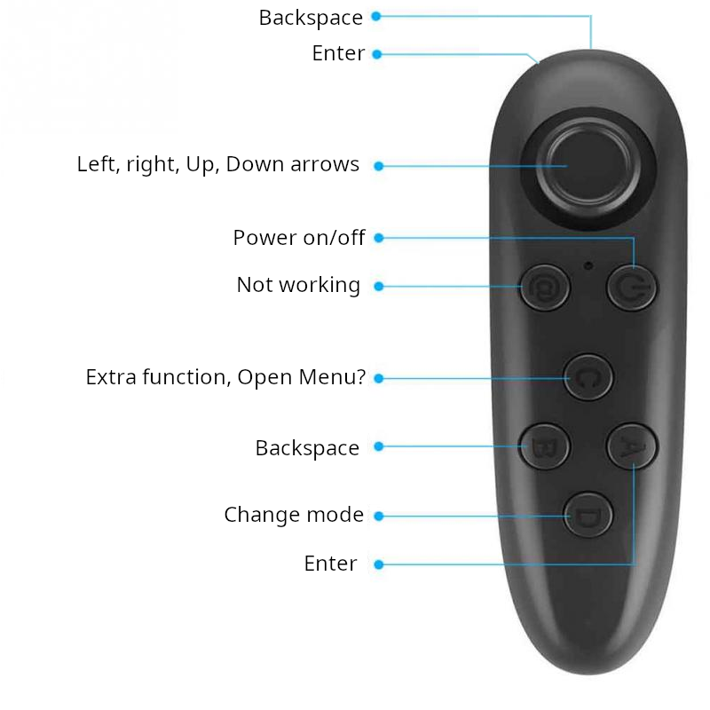

<a name="readme-top"></a>

[![Forks][forks-shield]][forks-url]
[![Stargazers][stars-shield]][stars-url]
[![Issues][issues-shield]][issues-url]
[![MIT License][license-shield]][license-url]


<!-- PROJECT LOGO -->
<br />
<div align="center">
  <a href="https://github.com/Risto97/vrpark_remap">
    
  </a>

  <h3 align="center">vrpark_remap</h3>

  <p align="center">
    Application that remaps cheap Aliexpress remote mouse to keyboard button presses.
    <br />
    <!-- <a href="https://github.com/Risto97/VeriSC"><strong>Explore the docs »</strong></a> -->
    <br />
    <br />
    <!-- <a href="https://github.com/Risto97/VeriSC">View Demo</a> -->
    <!-- · -->
    <a href="https://github.com/Risto97/vrpark_remap/issues">Report Bug</a>
    ·
    <a href="https://github.com/Risto97/vrpark_remap/issues">Request Feature</a>
  </p>
</div>

## About The Project

Intend of the project was to use one of the cheap Aliexpress bluetooth joysticks to control Kodi. <br />
Originally the joystick of the remote controller is acting as a mouse.


### Original Layout


### Remapped layout

The remapped controller has 2 modes, Mouse mode and Keyboard mode. <br />
It is possible to switch between modes by clicking D button, desktop notification is sent



#### Mouse mode

In this mode only VolumeUp is changed and is left for additional functionality.



#### Keyboard mode

This mode is meant to be used for Kodi player. <br />
Joystick is remmaped so that it gives left, right up, down key presses when moved. <br />
Buttons B, A are Backspace and Enter.




<p align="right">(<a href="#readme-top">back to top</a>)</p>


## Getting Started

### Prerequisites
* Python-evdev is used to intercept the inputs and inject keypresses
* Uinput kernel driver is used to inject inputs 
* Py-notifier for notifications
* Udev for detecting connection of controller and running the mapper app

<p align="right">(<a href="#readme-top">back to top</a>)</p>

### Installation

In order to install vrpark_remap you need to follow these steps:

1. Clone the repo
   ```sh
   git clone https://github.com/Risto97/vrpark_remap.git
   cd vrpark_remap
   ```
2. Install python dependencies
   ```sh
   pip install -r requirements.txt
   ```
3. Change 83-vr_park.rules path to script 
   ```sh
    KERNEL=="event[0-9]*", SUBSYSTEM=="input", SUBSYSTEMS=="input", ATTRS{name}=="VR-PARK", MODE="0660", RUN+="<path-to-local-git-repo>/run_remap.sh '%E{DEVNAME}'"
   ```
4. Change variable USER in run_remap.sh

5. Copy 83-vr_park.rules and 99-uinput.rules to /etc/udev/rules.d
    ```sh
    cp 83-vr_park.rules 99-uinput.rules /etc/udev/rules.d
    ```

6. Reload udev rules, if it doesnt help restart the PC
    ```sh
    udevadm control --reload
    udevadm trigger
    ```

Turning on the controller it should work now.

<p align="right">(<a href="#readme-top">back to top</a>)</p>

## Contact

Your Name - risto.pejasinovic@gmail.com - risto.pejasinovic@cern.ch

<p align="right">(<a href="#readme-top">back to top</a>)</p>

[forks-shield]: https://img.shields.io/github/forks/Risto97/vrpark_remap.svg?style=for-the-badge
[forks-url]: https://github.com/Risto97/vrpark_remap/network/members
[stars-shield]: https://img.shields.io/github/stars/Risto97/vrpark_remap.svg?style=for-the-badge
[stars-url]: https://github.com/Risto97/vrpark_remap/stargazers
[issues-shield]: https://img.shields.io/github/issues/Risto97/vrpark_remap.svg?style=for-the-badge
[issues-url]: https://github.com/Risto97/vrpark_remap/issues
[license-shield]: https://img.shields.io/github/license/Risto97/vrpark_remap.svg?style=for-the-badge
[license-url]: https://github.com/Risto97/vrpark_remap/blob/master/LICENSE
